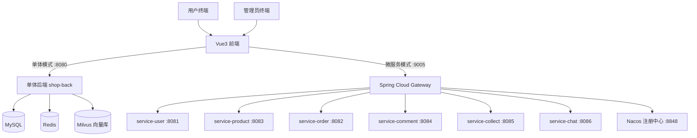

# 校易通 · 校园二手交易平台

[](https://adoptium.net)
[](https://spring.io)
[](#)
[](https://vuejs.org)

> 大学生创新创业训练计划（大创）项目 · 前后端分离 · 单体架构 → 微服务架构演进 · 集成 AI 大模型能力

面向高校学生的校园二手交易平台，覆盖**商品发布 / 浏览 / 上下架、订单交易、退款售后、收藏评论、即时聊天、后台审核与权限管理**的完整交易闭环；在此基础上融合 **AI 大模型对话、商品描述智能生成、校园知识图谱 + Milvus 向量检索（RAG）** 等增强能力。

代码仓库同时保留**单体版后端**与**微服务版后端**，前端共用一套 Vue3 应用，用于完整展示从单体到微服务的架构演进过程。

---

## ✨ 功能亮点

| 模块 | 说明 |
| --- | --- |
| 🛒 交易闭环 | 商品发布/编辑/上下架、多条件搜索、详情、下单、支付确认、取消、发货、收货、退款申请与处理 |
| 💬 即时聊天 | WebSocket 长连接，会话创建、消息收发、历史消息、已读标记 |
| ❤️ 互动体系 | 商品收藏、点赞、多级评论与回复 |
| 👥 后台管理 | 用户管理、角色管理、权限管理（RBAC）、商品审核、评论管理、数据统计大屏（ECharts） |
| 🤖 AI 能力 | 流式对话（DashScope Qwen）、AI 商品描述生成、校园知识图谱问答、基于 Milvus 的向量检索（RAG） |
| 🔐 安全设计 | JWT + Redis 登录态、自定义 `@PreAuthorize` 权限注解、参数校验、统一异常处理、图片魔数（文件头）校验上传 |
| 🚀 性能与治理 | Redis 缓存热点数据、Tomcat/Hikari 连接池调优、WebSocket 会话管理（微服务版含 Sentinel 限流熔断、Seata 分布式事务） |

## 🏗️ 架构设计

前端统一通过 `/api/backAll` 前缀访问后端；单体模式下由 Vite 开发代理转发，微服务模式下由 Spring Cloud Gateway 统一路由。



**架构演进**：项目最初以单体形态（`backend/`）快速实现全部业务闭环，随后参考领域驱动设计（DDD）理念按业务域拆分为 7 个微服务（`microservices/`），消除共享数据库反模式与胖单体问题，改造方案见 [`microservices/ARCHITECTURE_REFACTOR.md`](microservices/ARCHITECTURE_REFACTOR.md)。

## 🧰 技术栈

| 层 | 技术 |
| --- | --- |
| 前端 | Vue 3 · Vite · Element Plus · Pinia · Vue Router · Axios · ECharts · WebSocket |
| 单体后端 | Spring Boot 3.4 · MyBatis · MySQL · Redis · Milvus · WebSocket · Lombok |
| 微服务 | Spring Cloud 2023 · Spring Cloud Alibaba · Gateway · Nacos · Sentinel · Seata · OpenFeign |
| AI | DashScope（通义千问 qwen-plus）· 流式响应（SSE）· Spring AI 风格智能体/工具调用 |
| 构建 | Maven · npm | 

## 📁 目录结构

```
├── backend/          # 单体版后端（Spring Boot 3.4，端口 8080）
│   ├── src/main/java/com/itheima/   # controller / service / mapper / config / util ...
│   ├── db/                          # 完整数据库 dump（库名 shop）
│   └── pom.xml
├── frontend/         # Vue3 前端（端口 5173）
│   ├── src/                         # views / api / stores / components ...
│   └── vite.config.js               # 开发代理（/api/backAll → 后端）
├── microservices/    # 微服务版后端（Spring Cloud Alibaba）
│   ├── gateway/                     # 网关 :9005
│   ├── services/                    # 7 个业务服务（user/order/product/comment/collect/chat/main）
│   ├── common/ model/ sql/
│   ├── docker-compose.yaml          # MySQL / Redis / Milvus 一键启动
│   └── ARCHITECTURE_REFACTOR.md     # 单体 → 微服务改造方案
└── docs/             # 系统设计说明、总体设计、答辩 PPT 等文档
```

## 🚀 快速开始

### 环境要求

- JDK 17+（后端，本项目在 JDK 17.0.16 验证）、Maven 3.6+
- Node.js 18+、npm（前端，本项目在 Node 24 验证）
- MySQL 8+、Redis（必需）；Milvus（向量检索，可选）；Nacos（仅微服务模式）

### 第一步：数据库初始化

```bash
# 创建数据库并导入完整结构 + 初始数据（backend/db/ 下的 dump，库名 shop）
mysql -uroot -p < backend/db/_localhost-2026_03_05_18_59_11-dump.sql

# 微服务模式额外执行补充脚本（AI 对话会话表等）
mysql -uroot -p shop < microservices/sql/ai_chat_tables.sql
```

### 第二步：启动后端（二选一）

**模式 A：单体后端（推荐，最快跑通）**

```bash
cd backend
# 环境变量（按需设置，均有默认值）：
#   DB_PASSWORD         数据库密码（默认 1234）
#   IMAGE_UPLOAD_TOKEN  图床 Token（图片上传功能使用，留空则上传不可用）
#   DASHSCOPE_API_KEY   阿里云百炼 API Key（AI 对话/描述生成功能使用）
mvn spring-boot:run
# 启动后监听 http://localhost:8080
```

**模式 B：微服务全栈**

```bash
# 1. 启动基础设施：Nacos（startup.cmd -m standalone，默认 :8848）+ 可选 Sentinel
# 2. 启动 MySQL / Redis / Milvus（已提供 docker-compose.yaml）
cd microservices
docker compose up -d
# 3. 按依赖顺序启动服务：common → model → gateway → 各 service（端口 8081~8088）
mvn install -DskipTests
# 然后依次运行 gateway 与 services 下各模块
```

### 第三步：启动前端

```bash
cd frontend
npm install
npm run dev        # http://localhost:5173
```

前端通过 `frontend/.env.development` 决定后端指向：

- **微服务模式（默认）**：`VITE_API_BASE_URL="http://localhost:9005"` 直连网关；
- **单体模式**：改为 `VITE_API_BASE_URL=""`、`VITE_API_PROXY_TARGET="http://localhost:8080"`，由 Vite 代理转发并去除 `/api/backAll` 前缀。

### 环境变量汇总

| 变量 | 用途 | 默认值 |
| --- | --- | --- |
| `DB_PASSWORD` | MySQL 密码 | `1234` |
| `IMAGE_UPLOAD_TOKEN` | 第三方图床 Token | 空 |
| `DASHSCOPE_API_KEY` | 阿里云百炼（通义千问）API Key，AI 功能必需 | 空 |
| `app.milvus.init-enabled` | 启动时是否初始化 Milvus 商品向量集合（`--app.milvus.init-enabled=false` 跳过，适合本地无 Milvus 环境） | `true` |

### 功能降级策略（未配置外部依赖时）

未配置 `DASHSCOPE_API_KEY` / Ollama / Milvus 时，应用**仍可正常启动**，相关增强功能自动降级、不影响核心交易链路：

| 场景 | 行为 |
| --- | --- |
| AI 对话（本地 Ollama 未启动） | 返回友好提示并正常结束流（不报错） |
| AI 商品描述生成（Ollama 不可用） | 返回基于商品参数的模板描述 |
| RAG 语义搜索（未配置 Embedding/Milvus） | 自动降级为商品名称关键字搜索 |
| 图片上传（未配置 `IMAGE_UPLOAD_TOKEN`） | 仅上传功能不可用，其余不受影响 |

> 说明：出于安全考虑，所有密钥均通过环境变量注入（`application.yml` 中使用 `${VAR:默认值}` 占位），仓库中不提交任何真实凭据。

## 🧪 测试与验证

- 单体后端：`cd backend && mvn test`（JDK 17 下通过）
- 前端：`cd frontend && npm run build`（Node 24 下通过）
- 微服务：`cd microservices && mvn compile`（通过；`@SpringBootTest` 集成测试需要配置 `DASHSCOPE_API_KEY` 及本地中间件后运行）

## 📚 项目文档

- [系统设计说明](docs/校园二手交易平台系统设计说明.md)（功能模块、数据库设计、接口约定、性能优化）
- [系统总体设计说明](docs/校园二手交易平台（校易通）系统总体设计说明.docx)
- [系统设计与实现 PPT](docs/校园二手交易平台（校易通）系统设计与实现.pptx)
- [SPM 全项目文档总结（5 人敏捷版）](docs/校易通·RAG+协同过滤校园智能交易平台%20SPM%20全项目文档总结（5人敏捷版·飞书+Git工具链）.docx)
- [大模型方案说明](docs/校易通・大模型.docx)

## 📄 License

仅用于学习交流。
